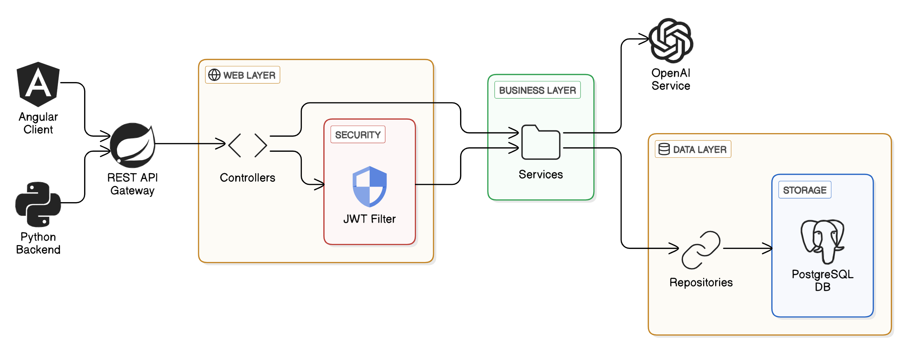

# Pattern AI - Design Pattern Analysis and Recommendation Platform


Pattern AI is an intelligent platform that analyzes codebases to identify design patterns, suggest improvements, and provide statistical insights about code quality. It combines AI-powered analysis with design pattern expertise to help developers write better, more maintainable code.

## Table of Contents

- [Architecture](#architecture)
- [Docker Configuration](#docker-configuration)
- [Frontend](#frontend)
- [Backend](#backend)
- [Getting Started](#getting-started)
- [API Documentation](#api-documentation)
- [Contributing](#contributing)

## Architecture



The application uses a modern microservices architecture with three main components:
- Angular frontend for user interface
- Spring Boot backend for business logic and AI integration
- Python backend for vector embeddings and code analysis
- PostgreSQL with pgvector for vector storage

## Docker Configuration

```yaml
services:
  springboot-backend:
    build: 
      context: ./backend_springboot
      dockerfile: Dockerfile
    ports:
      - "8080:8080"
    # ... other configuration

  python-backend:
    build: 
      context: ./backend_python
      dockerfile: Dockerfile
    ports:
      - "8000:8000"
    # ... other configuration

  frontend:
    build:
      context: ./frontend
      dockerfile: Dockerfile
    ports:
      - "4200:4200"
    # ... other configuration

  pgvector:
    image: ankane/pgvector
    # ... other configuration
```

## Frontend

### Technologies Used
- Angular 17+
- TailwindCSS
- TypeScript

### Key Features
- Interactive code analysis dashboard
- Real-time pattern recommendations
- Code quality metrics visualization
- Pattern implementation examples
- Chat interface for AI assistance

## Backend

### Spring Boot Backend

#### Technologies Used
- Spring Boot 3.x
- Spring Security with JWT
- Spring Data JPA
- PostgreSQL
- OpenAI Integration

#### Project Structure
```
ma.projet.patternai/
├── config/
├── controller/
├── entities/
├── service/
├── repository/
├── requests/
└── filters/
```

### Python Backend

#### Technologies Used
- LangChain
- pgvector
- Hugging Face Transformers

#### Features
- Code embedding generation
- Vector similarity search
- Pattern detection algorithms
- Code quality analysis

## Getting Started

### Prerequisites
- Docker and Docker Compose
- Node.js 18+
- Java 17
- Python 3.9+
- PostgreSQL 14+

### Local Development Setup

1. Clone the repository:
```bash
git clone https://github.com/AmalOur/pattern-ai.git
cd pattern-ai
```

2. Start the services using Docker Compose:
```bash
docker-compose up --build
```

3. Access the application:
- Frontend: http://localhost:4200
- Spring Boot API: http://localhost:8080
- Python API: http://localhost:8000
- PGVector: http://localhost:5432

## API Documentation

The API documentation is fully available through Swagger UI, providing an interactive interface to explore and test all endpoints.

### Accessing Swagger UI
- Link: http://localhost:8080/swagger-ui.html

### Features
- Interactive API documentation
- Request/response examples
- Try-it-out functionality for all endpoints
- Authentication integration
- Schema models visualization
- OpenAPI 3.0 specification

### Available Endpoints Categories
- Authentication Management
- Space Operations
- Design Pattern Analysis
- Chat Interactions
- Collection Management

To test the APIs:
1. Navigate to the Swagger UI URL
2. Authenticate using the "Authorize" button
3. Explore the available endpoints
4. Use the "Try it out" feature to make real API calls

The full API specification is also available in JSON format at `/v3/api-docs` and in YAML format at `/v3/api-docs.yaml`.

# Video Demonstration

Explore the functionality in action through the demonstration video provided below:

https://github.com/user-attachments/assets/e25bb8a4-d229-4ac5-92c8-7fcc908b6c78


# Contributing

We welcome contributions! Please see our [Contributing Guidelines](CONTRIBUTING.md) for more details.

## Contributors
- OURAJIM Amal ([GitHub](https://github.com/amalour))
- ABID Hanane ([GitHub](https://github.com/hananabid24))
- FARKHANE Salma ([GitHub](https://github.com/salmafar))
- ELOUSSOUL Ziyad ([GitHub](https://github.com/zyadeloussoul))
- ELBELLAJ Hamza ([GitHub](https://github.com/hamzaelbellaj))
- LACHGAR Mohamed ([Researchgate](https://www.researchgate.net/profile/Mohamed-Lachgar))

## License

This project is licensed under the [MIT License](LICENSE).
